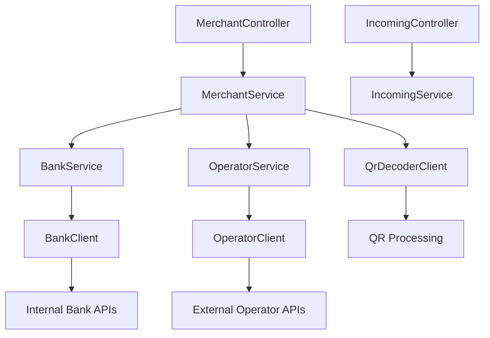

# Service Architecture

## Overview

The PSP service follows a layered architecture with clear separation of concerns between controllers, services, and external clients.

## Service Layer Organization

### Main Services (`/service/`)

| Service | Purpose | Implementation |
|---------|---------|----------------|
| `IncomingService` | Process incoming requests from operators | `IncomingServiceImpl` |
| `MerchantService` | Handle merchant operations and QR processing | `MerchantServiceImpl` |
| `BankService` | Internal bank transaction processing | `BankServiceImpl` |
| `OperatorService` | External operator transaction processing | `OperatorServiceImpl` |

### Client Services (`/service/clients/`)

External service clients are organized in a dedicated `clients/` folder for better separation of concerns:

| Client | Purpose | Implementation |
|--------|---------|----------------|
| `BankClient` | Internal bank operations and account validation | `BankClientImpl` |
| `OperatorClient` | External operator API interactions | `OperatorClientImpl` |
| `QrDecoderClient` | QR code parsing and ELQR data extraction | `QrDecoderClientImpl` |

## Service Dependencies



## Service Responsibilities

### MerchantService
- **Primary Role**: Entry point for merchant operations
- **Responsibilities**:
  - QR code validation and routing
  - Determine service provider (bank vs operator)
  - Coordinate between BankService and OperatorService
  - Handle merchant-specific business logic

### BankService
- **Primary Role**: Internal bank transaction processing
- **Responsibilities**:
  - Process transactions for internal bank merchants
  - Account validation and transaction creation
  - Integration with internal bank systems

### OperatorService
- **Primary Role**: External operator transaction processing
- **Responsibilities**:
  - Process transactions for external operator merchants
  - Handle operator-specific business logic
  - Integration with external operator APIs

### Client Services
- **BankClient**: Mock implementation for internal bank operations
- **OperatorClient**: Real implementation for external operator APIs
- **QrDecoderClient**: QR code parsing and ELQR data extraction

## Configuration

### Merchant Provider Routing
```yaml
merchant:
  provider: "demirbank"  # Routes to BankService
```

### Service Selection Logic
```java
private boolean isBankProvider(String merchantProvider) {
    return configuredMerchantProvider.equals(merchantProvider);
}
```

- **Bank Service**: Used when `merchantProvider` matches configured value
- **Operator Service**: Used for all other merchant providers

## Error Handling

All services implement consistent error handling:
- **PspException**: Base exception for all PSP-related errors
- **SystemErrorException**: For unexpected system errors
- **ResourceNotFoundException**: For missing resources
- **ValidationException**: For input validation errors

## Future Enhancements

### Planned Improvements
- **Redis Integration**: Caching and idempotency
- **RabbitMQ Integration**: Asynchronous processing
- **Circuit Breakers**: Resilience patterns for external calls
- **Metrics**: Service-level monitoring and observability

### Service Evolution
- **Client Abstraction**: Common interface for all external clients
- **Service Discovery**: Dynamic service provider selection
- **Load Balancing**: Multiple instances of external services
- **Retry Logic**: Configurable retry strategies

## Related Documentation

- [Architecture Overview](architecture.md) - System-wide architecture
- [API Endpoints](../api/endpoints-reference.md) - API specifications
- [Error Handling](../api/error-catalog.md) - Error codes and handling
- [Configuration](../runtime/configuration-reference.md) - Service configuration
