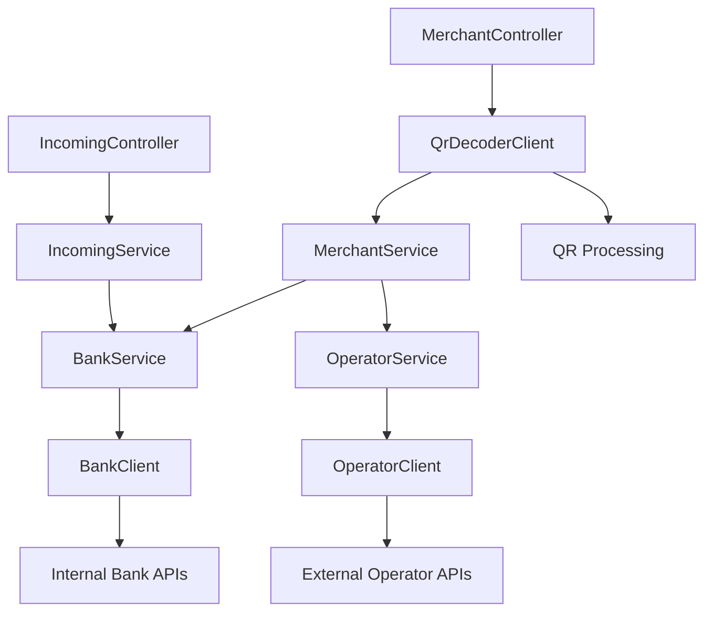

# Service Architecture

## Overview

The PSP service follows a layered architecture with clear separation of concerns between controllers, services, and external clients.

## Service Layer Organization

### Main Services (`/service/`)

| Service | Purpose | Implementation |
|---------|---------|----------------|
| `IncomingService` | Process incoming requests from operators | `IncomingServiceImpl` |
| `MerchantService` | Handle merchant operations and QR processing | `MerchantServiceImpl` |
| `BankService` | Internal bank transaction processing | `BankServiceImpl` |
| `OperatorService` | External operator transaction processing | `OperatorServiceImpl` |

### Client Services (`/service/clients/`)

External service clients are organized in a dedicated `clients/` folder for better separation of concerns:

| Client | Purpose | Implementation |
|--------|---------|----------------|
| `BankClient` | Internal bank operations and account validation | `BankClientImpl` |
| `OperatorClient` | External operator API interactions | `OperatorClientImpl` |
| `QrDecoderClient` | QR code parsing and ELQR data extraction | `QrDecoderClientImpl` |

## Service Dependencies



## Service Responsibilities

### MerchantService
- **Primary Role**: Business logic coordinator for merchant operations
- **Responsibilities**:
  - Route to appropriate service based on merchant provider
  - Determine service provider (bank vs operator)
  - Coordinate between BankService and OperatorService
  - Handle merchant-specific business logic for QR transactions
- **Note**: QR decoding is handled by MerchantController, not this service

### BankService
- **Primary Role**: Internal bank transaction processing + Incoming transaction management
- **Responsibilities**:
  - Process QR-based transactions for internal bank merchants
  - Handle incoming transactions from external operators
  - Account validation and transaction creation
  - Integration with internal bank systems
  - Execute and update incoming transactions
  - Support for both outgoing (QR) and incoming (direct) transaction flows

### OperatorService
- **Primary Role**: External operator transaction processing (QR-based only)
- **Responsibilities**:
  - Process QR-based transactions for external operator merchants
  - Handle operator-specific business logic
  - Integration with external operator APIs
  - Supports QR-based transactions only

### IncomingService
- **Primary Role**: Facade for incoming transaction operations
- **Responsibilities**:
  - Delegates all operations to BankService
  - Provides structured logging for incoming operations
  - Acts as a thin wrapper around BankService incoming methods

### Client Services
- **BankClient**: Mock implementation for internal bank operations
  - Supports both account validation and transaction creation
- **OperatorClient**: Real implementation for external operator APIs
  - Supports check, create, execute, and update operations
- **QrDecoderClient**: QR code parsing and ELQR data extraction
  - Used by MerchantController to decode QR once per request
  - Eliminates duplicate QR decoding in services

## Transaction Flow Types

### QR-Based Transactions (Outgoing)
- **Flow**: Merchant → PSP → Bank/Operator
- **Services**: MerchantService → BankService/OperatorService
- **Direction**: "OUT" (from PSP perspective)
- **Use Case**: Customer scans QR code to make payment

### Incoming Transactions (Direct)
- **Flow**: External Operator → PSP → Bank
- **Services**: IncomingService → BankService
- **Direction**: "IN" (to PSP perspective)
- **Use Case**: External operator initiates transaction directly
- **Note**: Only BankService supports incoming transactions

## Configuration

### Merchant Provider Routing
```yaml
merchant:
  provider: "demirbank"  # Routes to BankService
```

### Service Selection Logic
```java
private boolean isBankProvider(String merchantProvider) {
    return configuredMerchantProvider.equals(merchantProvider);
}
```

- **Bank Service**: Used when `merchantProvider` equals configured value ("demirbank")
  - Handles both QR-based transactions and incoming transactions
  - Full transaction lifecycle support
- **Operator Service**: Used for all other merchant providers
  - Handles QR-based transactions only
  - Does not handle incoming transactions
- **Incoming Service**: Always delegates to BankService regardless of provider

## Error Handling

All services implement consistent error handling:
- **PspException**: Base exception for all PSP-related errors
- **SystemErrorException**: For unexpected system errors
- **ResourceNotFoundException**: For missing resources
- **ValidationException**: For input validation errors

## Architecture Patterns

### Current Patterns
- **Service Layer**: Clear separation between controllers, services, and clients
- **Error Handling**: Centralized exception management with PspException hierarchy
- **DTO Organization**: Direction-based DTOs for clear data flow
- **Repository Pattern**: Entity-based data access with OperationRepository

## Related Documentation

- [Architecture Overview](architecture.md) - System-wide architecture
- [API Endpoints](../api/endpoints-reference.md) - API specifications
- [Error Handling](../api/error-catalog.md) - Error codes and handling
- [Configuration](../runtime/configuration-reference.md) - Service configuration
